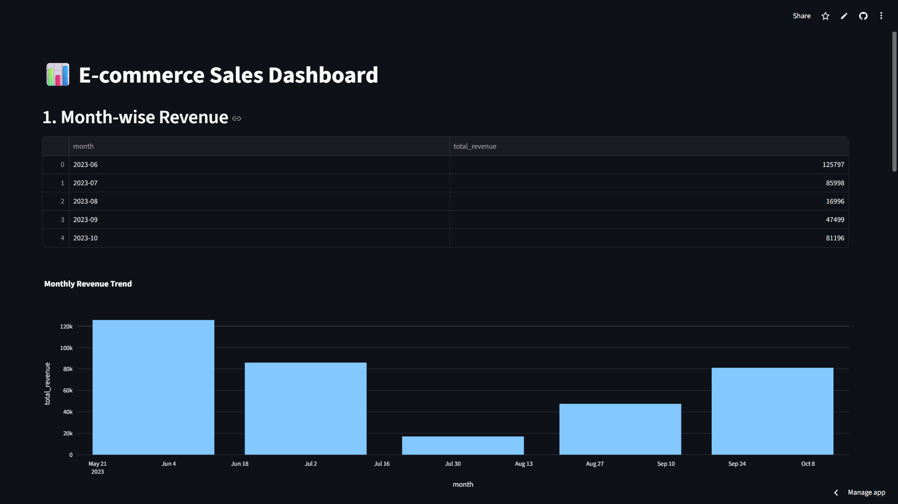

# E-commerce Sales Dashboard 📊 | SQL Analytics

Interactive Streamlit dashboard powered by SQL to analyze e-commerce sales data. Track monthly revenue, top customers, best-selling products, and city-wise performance using SQL queries.

### 🚀 Live Demo
**[Click Here to Launch Dashboard](https://ecommerce-sql-analysis-kzy2frzfqkgyd4a4xz9kxm.streamlit.app/)** 

### 📸 Dashboard Preview


### 🔥 Key SQL-Powered Features

**1. Month-wise Revenue**
- SQL `GROUP BY` + `DATE_TRUNC` to aggregate monthly sales
- Identifies seasonal trends: June peak, July-August dip, Sep-Oct recovery

**2. Top 3 Customers by Revenue**
- `JOIN` customers + orders table
- `ORDER BY total_spent DESC LIMIT 3`
- Amit Sharma, Priya Singh, Sneha Patel are highest value customers

**3. Best Selling Products**
- `GROUP BY product_id` with `SUM(quantity)` and `SUM(revenue)`
- Categories: Home, Electronics, Fashion
- Top Product: Coffee Mug - 5 units sold

**4. City-wise Revenue**
- `GROUP BY city` to find top performing locations
- Pie chart: Delhi, Mumbai, Pune, Bangalore revenue split

**5. Products Sold by Category**
- Bar chart comparison: Home vs Electronics vs Fashion
- Helps in inventory planning decisions

### 💡 Business Questions This Dashboard Answers
1. Which month had the highest revenue in 2023?
2. Who are our top 3 revenue-generating customers?
3. Which product category sells the most quantity?
4. Which city contributes maximum revenue to the business?

### 🛠️ Tech Stack
- **Frontend**: Streamlit
- **Database**: SQLite / PostgreSQL
- **Query Language**: SQL - JOINs, GROUP BY, Aggregations, Window Functions
- **Visualization**: Plotly, Matplotlib
- **Data Processing**: Pandas

### 💻 SQL Queries Used
```sql
-- 1. Month-wise Revenue
SELECT DATE_TRUNC('month', order_date) AS month, 
       SUM(amount) AS total_revenue 
FROM orders 
GROUP BY month 
ORDER BY month;

-- 2. Top 3 Customers
SELECT c.name, SUM(o.amount) AS total_spent
FROM customers c
JOIN orders o ON c.customer_id = o.customer_id
GROUP BY c.name
ORDER BY total_spent DESC LIMIT 3;

-- 3. Best Selling Products
SELECT p.name, p.category, 
       SUM(oi.quantity) AS total_quantity_sold,
       SUM(oi.quantity * oi.price) AS total_revenue
FROM products p
JOIN order_items oi ON p.product_id = oi.product_id
GROUP BY p.name, p.category
ORDER BY total_quantity_sold DESC;
